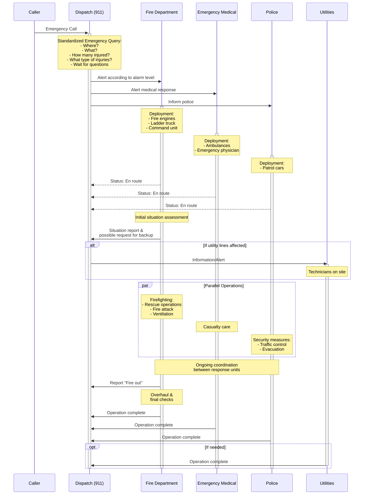

# City emergency response problem

[MAS-practical_work_24-25_presencial.pdf](City%20emergency%20response%20problem%2012d7997f05bd8064b60ed1d31cf507cd/MAS-practical_work_24-25_presencial.pdf)

# Task 1 - Design activity

### **Description**

- Environment analysis:
    - analyse and explain the environment in which agents will operate (lecture 2)
- Agent selection and definition:
    - More crews?
    - Which agents form a crew?
    - For each agent: brief description of who it is, main task, tools
- Agent taxonomy:
    - Types and properties of all agents in MAS (lecture 3)

→ PDF report with analysis + PDF presentation 8-10 slides

### Solution

**Environment analysis**

- Accessible/inaccessible
    - Complete, accurate, up-to-date information about environment
        - → Accessible, because we provide all informations??
        - OR → Inaccessible, because we try to model the physical world
- Deterministic/non-deterministic
    - Any action has a single guaranteed effect
        - → Non-deterministic, because we try to model the physical world
        - OR → Non-deterministic, because we don’t know what our agents will do??
- Episodic/non-episodic
    - Agent is only able to decide which action to perform, based on the current episode
        - → Episodic, because we run this 1x and then the system stops
- Static/dynamic
    - Static environment can be assumed to be unchanged except by the performance of actions of agents
        - → Static, because we don’t have anything that changes without Agents doing it
- Discrete/continuous
    - An environment is discrete if there is a fixed, finite number of actions and percepts in it
        - → Continuous, because we don’t know the number of possible actions performed by the agents

**Agent selection and definition**

- An idea could be that we add another level of crews into the system → fire people consist of different crews → rescue crew, extinguish crew, setup crew, …
    - Better is probably that an agent is no one single person, instead a team like rescue crew, …

**Crews and agents**

- Emergency
    - Contact agent (facilitate agent, contacts the rest)
- Fire
    - Organisation-team (choose most optimal department and unit(s))
    - Rescue-team (rescue people)
    - Fire-attack-team (water hose)
    - Ventilation-team (remove hot gases, smoke, toxic gases)
- Medical
    - Organisation-team (choose most optimal hospital/ medical centre and unit(s))
    - First-Aid-team (primary care)
    - Transportation-team (prepares ambulance truck’s devices for transportation)
- Police
    - Organisation-team (choose most optimal department and unit(s))
    - Patrol-team (secures site for traffic, evacuation)

# General

### Inputs

**Fire**

- Fire type: ordinary, electrical , gas, etc.
- X-location: X coordinate where the fire has originated
- Y-location: Y coordinate where the fire has originated
- Injured people: how many people has been injured due to the fire
- Fire severity: the severity of the fire, which can be low, medium or high
- …

Agents must extract from written text in Markdown format

**Ambulances, fire trucks, hospitals**

- ID: the string identifying the ambulance/ fire truck/ hospital
- X-coordinate: X coordinate of the ambulance/ fire truck/ hospital
- Y-coordinate: Y coordinate of the ambulance/ fire truck/ hospital
- Type: type of fire truck, rescue, ladder, etc. (for fire truck)
- Capacity: the number of fire people the truck can transport (for fire truck)
- Available beds: beds available in the nearby hospital
- …

This information must be encoded in a structured file, e.g. JSON file

---

### Crews

- Emergency service: receives call, notify fire people and medical services → facilitator agent
- Fire people: organises fire departments all over the city, choose most optimal unit(s) according to fire characteristics
- Medical service: organises medical centres, hospitals all over the city, choose most optimal health centre(s) according to injury characteristics

---

### Requirements

- Agent crews: above crews must be included, open for more
- Pipelines and routers usage: pipelines and routers must be used
- Input file creation:
    - City graphml map
    - Emergency report
    - Ambulances
    - Fire trucks
    - Hospitals
- README: must contain summary of MAS work, provided files, custom tools, etc.
- Git: use of git

---

**Tools**

- Communication systems (CS): For emergency services to receive calls and coordinate with other departments
- Dispatch software (DS): To alert fire departments and medical services according to the emergency level
- Mapping and navigation tools (MN): To determine the location of emergencies and plan routes for response vehicles
- Resource management systems (RM): To track and allocate fire trucks, ambulances, and hospital beds
- Data analysis tools (DA): To assess fire severity, injury types, and determine optimal response units
- Coordination software (COOR): To facilitate ongoing communication between different response units during operations

### Agent taxonomy

**Properties of Agents**

1. Flexibility: Agents can adapt to changes in their environment
2. Reactivity: Ability to monitor environment and respond to changes in real time
3. Proactiveness: Agents do not just wait for events to occur, but actively pursue goals
4. Social Ability: Capability of agents to communicate with other agents and people
5. Rationality: Agents work towards goals while avoiding actions that would prevent achieving them
6. Reasoning Capabilities: Make decisions based on logic, knowledge, and learning from past experiences
7. Learning: Capacity to improve over time by gaining knowledge from past experiences
8. Autonomy: Ability to act independently, reducing the need for human oversight
9. Temporal Continuity: Agents operate continuously over time, unlike programs that run once and then stop
10. Mobility: Agent's ability to move between different locations or systems

Impossible to have all those properties. Most basic properties: autonomy, reactiveness, reasoning and learning, communication

- **Agent Types**
    1. Collaborative Agents: Emphasise communication and cooperation with other agents to solve large, distributed problems
    2. Interface Agents: Focus on autonomy and learning to help users with tasks, acting as personal assistants
    3. Information Agents: Manage access to and retrieval of information from various sources
    4. Facilitator Agents: Help manage the communication and coordination between other agents in a multi-agent system, ensuring smoother coordination
- **Agentification Mechanisms**
    - Methods to integrate existing applications into a multi-agent system:
        - Translator: Acts as a bridge between the application and other agents
        - Wrapper: Adds code to the application for direct communication with agents
        - Re-coding: Rewriting the original program as an agent

---

| **Crew** | **Agent** | **Who** | **Task** | **Tools** | Properties | Types |
| --- | --- | --- | --- | --- | --- | --- |
| Emergency | Contact Agent | Person that answers the call sitting in a emergency call center | Get most important information (where, what, how many injured, type of injuries, wait for questions) | CS
DS | Reactivity, Social Ability, Reasoning Capabilities | Facilitator Agent, Information Agent |
| Fire | Organisation Agent | Fire person that answers call sitting in a fire department | Get most important information regarding fire (type, X, Y, injured people, severity, …) | CS
MN
RM
DA | Flexibility, Proactiveness, Reasoning Capabilities | Collaborative Agent, Information Agent |
| Fire | Rescue Agent | Fire person that drives to the site and saves peoples lives | Drive to the emergency site and rescue people out of/ in front of the burning building | CS
MN
DA
COOR | Reactivity, Autonomy, Social Ability | Collaborative Agent |
| Fire | Fire-Attack Agent | Fire person that drives to the site and extinguishes the fire | Drive to emergency site and pull out the hose and extinguish | CS
MN
DA
COOR | Reactivity, Autonomy, Reasoning Capabilities | Collaborative Agent |
| Fire | Ventilation Agent | Fire person that drives to the site and handles everything regarding gas | Drive to emergency site and analyse gas/oxygen situation and take corresponding actions | CS
MN
DA
COOR | Reactivity, Autonomy, Reasoning Capabilities | Collaborative Agent |
| Medical | Organisation Agent | Medical person that answers call sitting in a medical department | Gather most important information regarding medical situation (injured people, closest centre, closest ambulance, …) | CS
MN
RM
DA | Flexibility, Proactiveness, Reasoning Capabilities | Collaborative Agent, Information Agent |
| Medical | First-Aid Agent | Medical person that drives in an ambulance to the site | Drive to the emergency site in an ambulance and provide primary care for injured people | CS
MN
DA
COOR | Reactivity, Autonomy, Reasoning Capabilities | Collaborative Agent |
| Medical | Transportation Agent | Medical person that drives in an ambulance to the site | Drive tot the emergency site in an ambulance and prepare the truck for transportation while first aid is doing their thing | CS
MN
DA
COOR | Reactivity, Autonomy, Social Ability | Collaborative Agent |
| Police | Organisation Agent | Police person that answers call sitting in a police department | Get most important information regarding whole situation (type of fire, X, Y, traffic, other dangers, …) | CS
MN
RM
DA | Flexibility, Proactiveness, Reasoning Capabilities | Collaborative Agent, Information Agent |
| Police | Patrol Agent | Police person that drives to the site in a patrol car | Secure site for traffic, provide evacuation, help wherever they can | CS
MN
DA
COOR | Reactivity, Autonomy, Social Ability | Collaborative Agent |