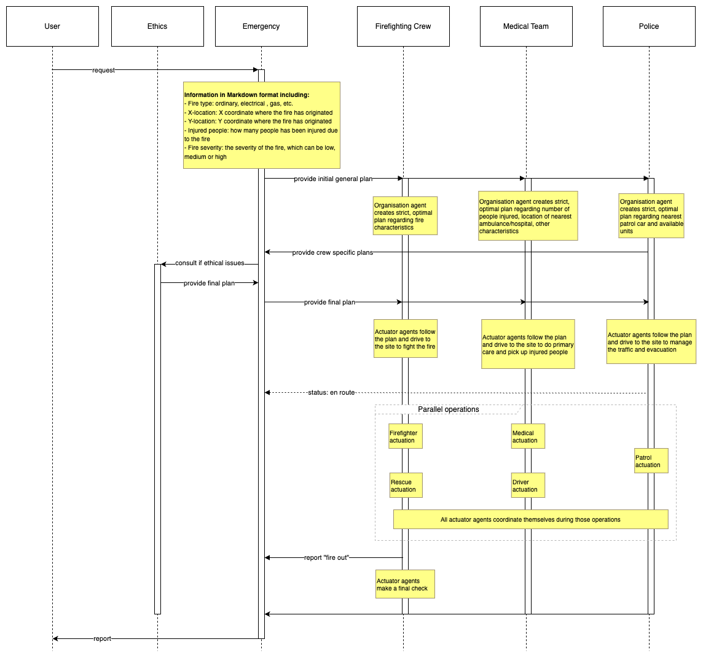

# Design of a Multi-Agent System for Emergency Response Simulation in Urban Environments: Task 1.

**Students:**
Pedro Agundez Fernández,
Pau Baguer Fàbrega,
Carlos Jiménez Farfán,
Kacper Krzysztof Poniatowski,
Niklas Long Schiefelbein

## Introduction

This is the report for Task 1, which presents the initial design of a Multi-Agent System (MAS) for managing emergency responses in an urban city. The objective of this project is to simulate a coordinated response among various autonomous agents to solve rescue scenarios which may contain fires, medical injuries, traffic management, etc. The environment will be carefully selected to emulate the real-world challenges and complexities of emergency management, including the optimization of resource allocation to ensure a precise and timely response by the emergency crews.

In this design phase, we focus on analyzing the environment, selecting and defining crews and agent roles, and classifying the agents within the system. The environment includes critical components such as fire trucks, ambulances, hospitals and other emergency services, each positioned and equipped based on realistic constraints. Our agents are structured into dedicated crews, each responsible for distinct aspects of the emergency response, including emergency coordination, fire containment, medical support, and ethical analysis.

# 1. Environment analysis

### Accessibility

The city map is designed to be generally accessible to all agents, with specific areas defined as inaccessible. Each agent, however, has a limited perception of the environment; they are only aware of their current location, the severity and type of any fire nearby, and the number of wounded individuals in the vicinity. To obtain a comprehensive view of the entire situation, agents need to communicate and share information regarding these details with one another.

### Determinism

The environment operates in a **Non-Deterministic** manner, meaning that actions do not always yield the same outcomes. Probabilistic factors influence the success or failure of certain actions. For example, an agent's attempt to extinguish a fire may not always be successful, as external conditions could allow the fire to persist or even spread.

### Episodicity

This environment is characterized as **Non-Episodic**. There is no reliance on a training algorithm involving distinct episodes, as the system utilizes pre-trained language models, allowing it to operate continuously. However, each emergency report received by agents can be considered a self-contained episode for practical purposes.

### Dynamism

The environment is **Dynamic**, with evolving conditions over time. Fires can grow in intensity if not extinguished, and the health of injured individuals may deteriorate if they do not receive timely assistance. This dynamism adds complexity to the agents' decision-making processes.

### Continuity

In terms of space and time, the environment is **Continuous**. Agents are free to navigate across continuous X and Y coordinates on the map. While the overall map and time structure remain continuous, agent actions, such as moving or extinguishing a fire, are performed in discrete steps.

# 2. Agent selection and definition

- **Emergency crew**  
  - **Contact agent.** Recieves the report in natural language and compiles the data in json format to pass it to the organization agents.  
    - **Type:** Facilitator
    - **Tools:** FileReadTool
  - **Planner agent.** Recieves the plans from each organization agent and compiles them into a global plan, consults with the ethics crew in case there are ethical dilemmas.  
    - **Type:** Facilitator

- **Ethics crew**  
  - **Philosopher agent.** Recieves an ethic dilemma from the emergency planner and solves it using RAG to extract the conclusion from an ethics "book" (text file).  
    - **Type:** Facilitator
    - **Tools:** FileReadTool
    
- **Firefighting crew**  
  - **Organization Agent:** Receives the structured information from the emergency contact agent, creates a list of tasks taking into account the resources available and the distance to the emergencies. Then it sends its plan to the emergency planner agent, when the whole plan is compiled (planner agent has responded), it passes the tasks to the actuators.  
    - **Type:** Facilitator  
    - **Deliberative:** Makes a general plan to be executed by Actuator agents. This plan does not include small details as the Agent will now know the full state of the environment. Remember, the environment is not fully accessible.*  
    - **Reactive:** Will change plan based on the evolution of the emergency.
    - **Tools:** DistanceMetricTool
      
  - **(3x) Firefighter Actuator Agent:** Follows the plan of the Organization Agent. (Fights fire).  
    - **Type:** Actuator.  
    - *Hybrid (follows a plan and takes small decisions). A small obstacle does not imply that the organization agent needs to know about it and change the whole plan. Little obstacles can be surpassed by the Actuator Agent’s own decisions.*  
    - *Reactive: Will change plan based on the evolution of the emergency.*  
  - **(3x) Rescue Actuator Agent:** Follows the plan of the Organization Agent. (Rescues people)  
    - **Type:** Actuator.  
    - *Hybrid*  
    - Reactive: Will change plan based on the evolution of the emergency.  

- **Medical crew**  
  - **Organization Agent:** Receives the structured information from the emergency contact agent, creates a list of tasks taking into account the resources available and the distance to the emergencies. Then it sends its plan to the emergency planner agent, when the whole plan is compiled (planner agent has responded), it passes the tasks to the actuators. 
    - **Type:** Facilitator  
    - **Deliberative**
    - **Tools:** DistanceMetricTool  
  - **(3x) Med Actuator Agent:** Follows the plan of the Organization Agent. (Attends victims, first aid).  
    - **Type:** Actuator.  
    - **Hybrid**  
  - **(3x) Driver Actuator Agent**: Follows the plan of the Organization Agent. (Drives ambulance).  
    - **Type:** Actuator.  
    - **Hybrid**
- **Police Crew**  
  - **Organization Agent:** Receives the structured information from the emergency contact agent, decides on what alternative routes should be created to avoid roads that are blocked by fires.  
    - **Type:** Facilitator  
    - **Deliberative**
    - **Tools:** DistanceMetricTool 
  - **(3x) Patrol Actuator Agent:** Follows the plan of the Organization Agent. (Drives patrol car, manages traffic and evacuation).  
    - **Type:** Actuator.  
    - **Hybrid**  

# Agent Taxonomy

## 3. Agent Taxonomy Analysis

### 3.1 Overview
This section of the report analyses the properties of each of the agents outlined in the previous section (Contact Agent, Organisation Agent, Actuator Agent, and Philosopher Agent). For each agent type, we examine which properties are present and provide justification for these design decisions.

### 3.2 Agent Property Analysis
|                  | Emergency          | Firefighting Crew          |                  | Medical Team            |                  | Police Crew              |                  | Ethics Crew                                                                                                                                                                                                                                                                                    |
|------------------|--------------------|----------------------------|------------------|--------------------------|------------------|--------------------------|------------------|-------------------------------------------------------------------------------------------------------------------------------------------------------------------------------------------------------------------------------------------------------------------------------------------------|
|                  | **Contact Agent**  | **Organization Agent**     | **Actuator Agent** | **Organization Agent**   | **Actuator Agent** | **Organization Agent**   | **Actuator Agent** |   **Philosopher Agent**      |                                                                                                                                                                                                                                                                                        |
| **Flexibility**  | YES                | YES                        | YES              | YES                      | YES              | YES                      | YES              | YES  |
| **Reactivity**   | YES                | YES                        | YES              | YES                      | YES              | YES                      | YES              | YES  |
| **Proactiveness**| NO                 | YES                        | YES              | YES                      | YES              | YES                      | YES              | NO  |
| **Social Ability** | YES             | YES                        | YES              | YES                      | YES              | YES                      | YES              | YES |
| **Rationality**  | YES                | YES                        | YES              | YES                      | YES              | YES                      | YES              | YES  |
| **Reasoning**    | YES                | YES                        | LESS             | YES                      | LESS             | YES                      | LESS             | YES   |
| **Learning**     | NO                 | NO                         | NO               | NO                       | NO               | NO                       | NO               | NO |
| **Autonomy**     | HIGH               | HIGH                       | LOW              | HIGH                     | LOW              | HIGH                     | LOW              | HIGH  |
| **Temporal continuity** | YES        | YES                        | YES              | YES                      | YES              | YES                      | YES              | YES |
| **Mobility**     | NO                 | NO                         | YES              | NO                       | YES              | NO                       | YES              |  NO |

### 3.3 Property Justification
#### 3.3.1 Flexibility
All agents = YES

Essential in emergency response where situations are dynamic and unpredictable.
Agents must adapt to changing circumstances (new fires, resource constraints, casualties).
Even with predefined protocols, flexibility allows for situational adaptation.

#### 3.3.2 Reactivity
All agents = YES

All agents must respond to changes in their environment.
Emergency situations are inherently unpredictable and require immediate responses.
Examples: Contact Agent reacts to new reports, Organization Agents to resource changes, Actuators to field conditions.

#### 3.3.3 Proactiveness

Contact & Philosopher = NO

Only respond to incoming reports/queries.
Cannot anticipate when emergencies will occur or when ethical guidance will be needed.

Organization & Actuator = YES

Must anticipate potential scenarios and prepare accordingly.
Example: Organization Agent preparing backup plans, Actuators positioning for better response.

#### 3.3.4 Social Ability
All agents = YES

Essential for coordination in a multi-agent system.
Emergency response requires constant communication between all levels.
Information must flow smoothly between planning and execution.

#### 3.3.5 Rationality
All agents = YES

All decisions must be based on logical evaluation of available information.
Critical in emergency situations where resources and time are limited.
Ensures consistent and justifiable decision-making.

#### 3.3.6 Reasoning

Contact, Organization, Philosopher = YES

Required for complex decision-making and planning.
Must process multiple variables and constraints.

Actuator = LESS

Follows pre-defined plans with limited decision-making scope.
Only needs basic reasoning for immediate field decisions.

#### 3.3.7 Learning
All agents = NO

System relies on predefined protocols for consistency.
Emergency response requires predictable, reliable behavior.
Learning could introduce unpredictability in critical situations.

#### 3.3.8 Autonomy

Contact, Organization, Philosopher = HIGH

Need independence to make complex decisions.
Must handle multiple scenarios without constant oversight.

Actuator = LOW

Follows organization agent's plans.
Limited decision-making scope to ensure plan consistency.

#### 3.3.9 Temporal Continuity
All agents = YES

Emergency response system must operate continuously.
No agent can have "downtime" as emergencies can occur anytime.
System must maintain readiness 24/7.

#### 3.3.10 Mobility

Contact, Organization, Philosopher = NO

Operate from fixed command/control positions.
Focus on planning and coordination.

Actuator = YES

Must physically respond to emergencies.
Requires movement to execute plans in the field.